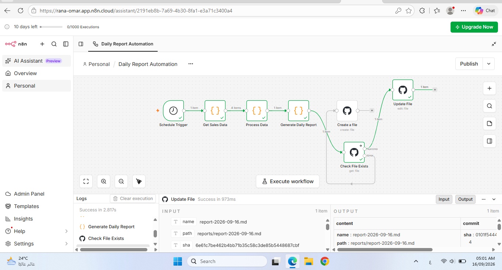

# 📊 Daily Sales Report Automation

An automated daily sales reporting workflow built with **n8n**, **JavaScript**, and **GitHub**.

This project was created as a hands-on mini project to practice workflow automation, data processing, JSON, expressions, and GitHub integration.

---


## 🚀 Project Overview

The workflow automatically processes sales data and generates a daily sales report.

Instead of manually calculating sales metrics and creating a report, the workflow performs these steps automatically.

### Workflow

```text
Schedule Trigger
       ↓
Get Sales Data
       ↓
Process Sales Data
       ↓
Generate Daily Report
       ↓
Save Report to GitHub
```

---

## ⚙️ How It Works

### 1. Schedule Trigger ⏰

The workflow is scheduled to run automatically once per day.

### 2. Get Sales Data 📥

The workflow receives sample sales data containing:

* Product
* Quantity
* Price

### 3. Process Sales Data 🧮

JavaScript is used to process the data and calculate:

* Total Orders
* Total Items Sold
* Total Sales
* Average Order Value

### 4. Generate Daily Report 📝

The processed data is converted into a structured Markdown report.

Example:

```text
Daily Sales Report

Date: 2026-09-16

Summary:

Total Orders: 4
Total Items Sold: 12
Total Sales: $2250.00
Average Order Value: $562.50
```

### 5. Save Report to GitHub 🐙

The generated report is automatically saved to the GitHub repository with the current date.

Example:

```text
reports/
└── daily-report-2026-09-16.md
```

---

## 🛠️ Technologies

* **n8n** — Workflow automation
* **JavaScript** — Data processing and calculations
* **JSON** — Data structure and workflow communication
* **GitHub** — Automated report storage

---

## 📊 Sample Data

The project currently uses sample sales data for learning purposes.

Example:

| Product  | Quantity | Price |
| -------- | -------: | ----: |
| Laptop   |        2 |  $800 |
| Mouse    |        5 |   $20 |
| Keyboard |        3 |   $50 |
| Monitor  |        2 |  $200 |

---

## 🎯 What I Practiced

Through this project, I practiced:

* Building workflows with n8n
* Schedule-based automation
* Working with JSON data
* JavaScript data processing
* Using n8n expressions
* Calculating business metrics
* Generating automated reports
* Integrating n8n with GitHub

---

## 🔮 Future Improvements

Planned improvements include:

* Replace sample data with a real API
* Connect the workflow to a database
* Add Google Sheets integration
* Send reports automatically by Email
* Add Telegram notifications
* Add error handling
* Add data validation
* Integrate AI for automated report summaries

---

## 📌 Project Status

🟢 Completed — Mini Project

This project is part of my hands-on learning journey in **AI, Data, and Automation**.

More advanced automation projects will be added as I continue learning.
